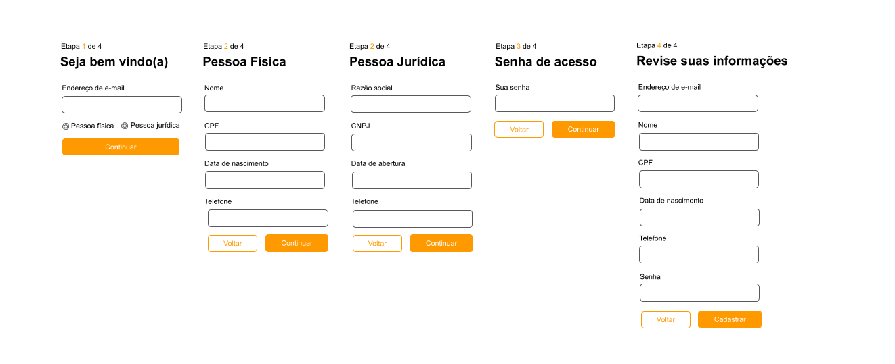

[Portuguese](#formulário-em-etapas) | [English](#step-form)

# Formulário em etapas



## Tecnologias Utilizadas

- **VueJS 3**: Utilizando a Composition API para construção dos componentes frontend.
- **Node.js com Express**: Usados para executar um servidor simples responsável por servir a aplicação e manipular solicitações de API.
- **CSS**: O projeto utiliza um [sistema de grade de 8 pontos](https://spec.fm/specifics/8-pt-grid) para consistência de layout e [BEM](https://getbem.com) para nomeação de classes CSS para melhorar a legibilidade e manutenção.

---

# Guia de Configuração e Execução do Projeto

## Pré-requisitos

Certifique-se de ter o [Node.js](https://nodejs.org/en) instalado. A fim de promover consistência entre os ambientes de desenvolvimento, este projeto especifica a versão do Node no arquivo .nvmrc:

```plaintext:.nvmrc
lts/iron
```

Você pode gerenciar diferentes versões do Node em seu sistema usando o [nvm](https://github.com/nvm-sh/nvm).

## Instruções de execução local

1. **Clone o repositório**:

   ```sh
   git clone https://github.com/educbraga/step-form.git
   ```

   ```sh
   cd <diretorio-do-repositorio>
   ```

2. **Instale as dependências**:

   ```sh
   npm install
   ```

3. **Para visualizar a aplicação, execute o servidor**:

   ```sh
   npm run server
   ```

   Este comando irá gerar uma build com o Vite e iniciar o servidor Express que é responsável pela API backend e expor a aplicação em seu navegador.

4. **Acesse a aplicação em seu navegador de preferência em**:

   ```sh
   http://localhost:3000
   ```

---

Opcional - **Para desenvolvimento, execute o servidor de desenvolvimento**:

```sh
npm run dev
```

## Endpoints

`[GET] /registration`

- Responsável por renderizar uma página html que irá carregar os componentes do formulário no browser.

`[POST] /registration`

- API de cadastro responsável por receber os dados submetidos pelo usuário em formato JSON e responder para o client.

## Informações adicionais

O macro defineModel() utilizado no projeto foi uma adição do vue 3.4. Ele agrega uma prop e um emit. Para mais informações acesse:

- https://vuejs.org/api/sfc-script-setup.html#definemodel
- https://vuejs.org/guide/components/v-model.html

---

# Step Form


## Technologies Used

- **VueJS 3**: Using the Composition API to build frontend components.
- **Node.js with Express**: Used to run a simple server responsible for serving the application and handling API requests.
- **CSS**: The project uses an [8-point grid system](https://spec.fm/specifics/8-pt-grid) for layout consistency and [BEM](https://getbem.com) for CSS class naming to improve readability and maintainability.

---

# Project Setup and Execution Guide

## Prerequisites

Make sure you have [Node.js](https://nodejs.org/en) installed. To ensure consistency across development environments, this project specifies the Node version in the `.nvmrc` file:

```plaintext:.nvmrc
lts/iron
```

You can manage different Node versions on your system using [nvm](https://github.com/nvm-sh/nvm).

## Local Execution Instructions

1. **Clone the repository**:

   ```sh
   git clone https://github.com/educbraga/step-form.git
   ```

   ```sh
   cd <repository-directory>
   ```

2. **Install dependencies**:

   ```sh
   npm install
   ```

3. **To view the application, start the server**:

   ```sh
   npm run server
   ```

   This command will generate a build using Vite and start the Express server, which handles the backend API and serves the application in your browser.

4. **Access the application in your preferred browser at**:

   ```sh
   http://localhost:3000
   ```

---

Optional - **For development, run the development server**:

```sh
npm run dev
```

## Endpoints

`[GET] /registration`

- Renders an HTML page that loads the form components in the browser.

`[POST] /registration`

- Registration API responsible for receiving user-submitted data in JSON format and responding to the client.

## Additional Information

The `defineModel()` macro used in this project was introduced in Vue 3.4. It combines a prop and an emit. For more information, visit:

- [https://vuejs.org/api/sfc-script-setup.html#definemodel](https://vuejs.org/api/sfc-script-setup.html#definemodel)
- [https://vuejs.org/guide/components/v-model.html](https://vuejs.org/guide/components/v-model.html)


